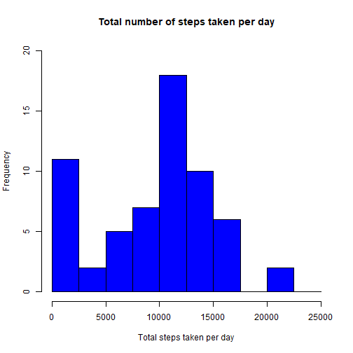
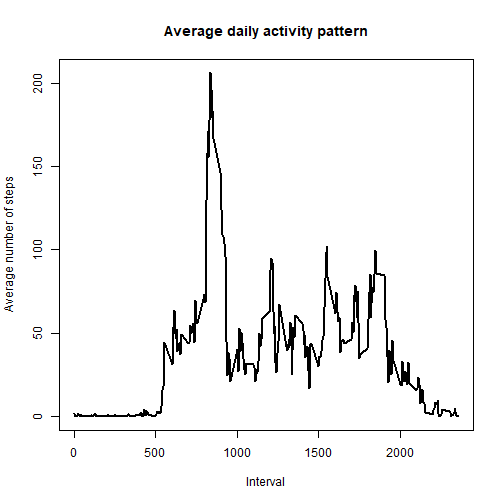
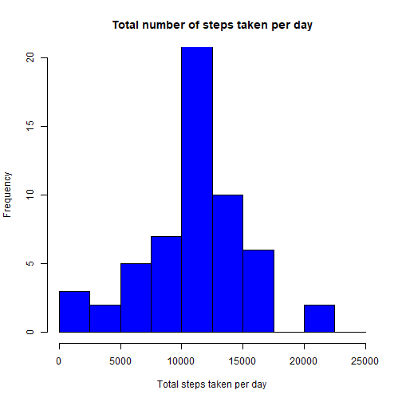
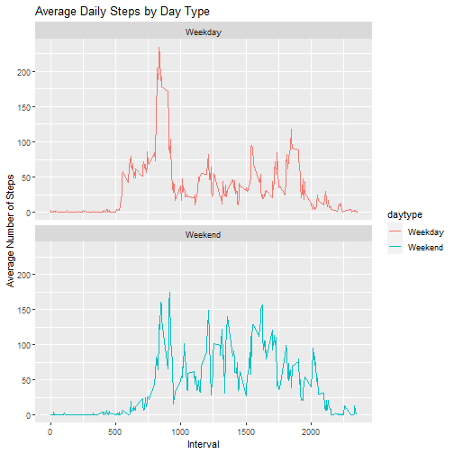

## Introduction
This assignment makes use of data from a personal activity monitoring device. This device collects
data at 5 minute intervals through out the day. The data consists of two months of data from an 
anonymous individual collected during the months of October and November, 2012 and include the 
number of steps taken in 5 minute intervals each day.

## Loading and preprocessing the data

```r
opts_chunk$set(echo = TRUE, warning = FALSE)
dat <- read.csv("activity.csv")
dat$date <- as.POSIXct(dat$date, "%Y/%m/%d")
dat$day <- weekdays(dat$date)
```

## What is mean total number of steps taken per day?

```r
datdf <- with(dat, aggregate(steps, by = list(date), FUN = sum, na.rm = TRUE))
names(datdf) <- c("date", "total")
with(datdf, hist(total,
     main = "Total number of steps taken per day",
     xlab = "Total steps taken per day",
     col = "blue",
     ylim = c(0,20),
     breaks = seq(0,25000, by=2500)))
```


### Calculate and report the mean and median total number of steps taken per day

```r
mean(datdf$total)
```

```
## [1] 9354.23
```

```r
median(datdf$total)
```

```
## [1] 10395
```

## What is the average daily activity pattern?

```r
library(tidyverse)
datdf2 <- dat %>% 
  group_by(interval) %>%
  drop_na(steps) %>%
  summarise(average = mean(steps))

with(datdf2, plot(interval, average, type = "l", lwd = 2,
                  xlab="Interval",
                  ylab="Average number of steps",
                  main="Average daily activity pattern"))
```


### Which 5-minute interval, on average across all the days in the dataset, contains the maximum number of steps?

```r
datdf2$interval[which.max(datdf2$average)]
```

```
## [1] 835
```

## Imputing missing values

```r
#total number of missing values
sum(is.na(dat$steps))
```

```
## [1] 2304
```

```r
#Devise a strategy for filling in all of the missing values in the dataset.
filled_steps <- datdf2$average[match(dat$interval, datdf2$interval)]

# Create a new dataset that is equal to the original dataset but with the missing data filled in
filled_df <- transform(dat, steps = ifelse(is.na(dat$steps), yes = filled_steps, no = dat$steps))

# Make a histogram of the total number of steps taken each day and Calculate and report the mean and median total number of steps taken per day.
datdf3 <- aggregate(steps ~ date, filled_df, sum)
names(datdf3) <- c("date", "steps")
with(datdf3, hist(steps,
                  main = "Total number of steps taken per day",
                  xlab = "Total steps taken per day",
                  col = "blue",
                  ylim = c(0,20),
                  breaks = seq(0,25000, by=2500)))
```



```r
mean(datdf3$steps)
```

```
## [1] 10766.19
```

```r
median(datdf3$steps)
```

```
## [1] 10766.19
```

## Are there differences in activity patterns between weekdays and weekends?

```r
dat$daytype <- sapply(dat$date, function(x) {
  if(weekdays(x) == "Saturday" | weekdays(x) == "Sunday")
  {y <- "Weekend"}
  else {y <- "Weekday"}
  y
})

#Make a panel plot containing a time series plot
dat_by_day <-  aggregate(steps ~ interval + daytype, dat, mean, na.rm = TRUE)

ggplot(dat_by_day, aes(x = interval , y = steps, color = daytype)) + 
  geom_line() + ggtitle("Average Daily Steps by Day Type") + 
  xlab("Interval") + 
  ylab("Average Number of Steps") +
  facet_wrap(~daytype, ncol = 1, nrow=2)
```


